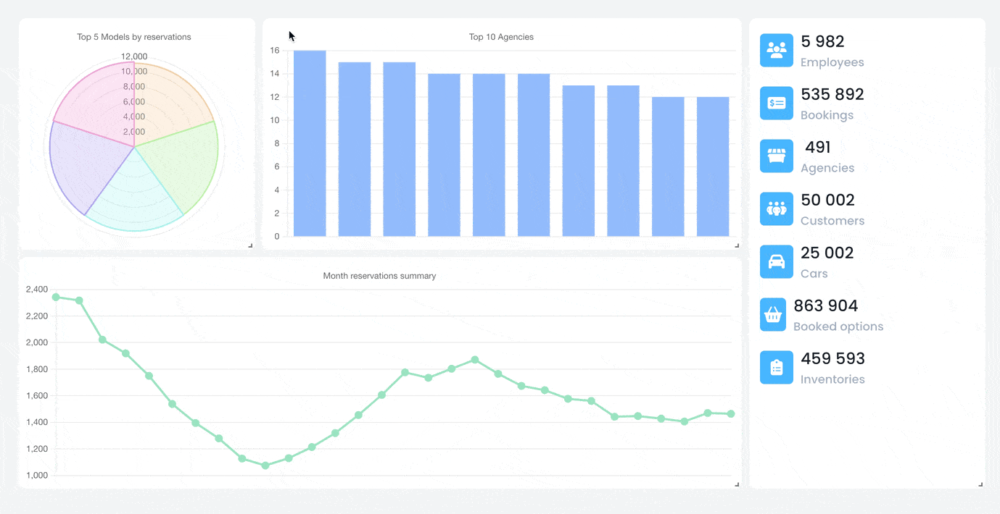

# Overview

Enhance the capabilities of your dashboard with qodly-grid-layout.

## Properties

| Name                | Attribute          | Type    | Required | Default | Description                                                     |
| ------------------- | ------------------ | ------- | -------- | ------- | --------------------------------------------------------------- |
| `Filter Mode`       | `filterMode`       | Boolean | No       | true    | Determines the filter mode.                                     |
| `Save In Storage`   | `saveInStorage`    | Boolean | No       | false   | Saves the state in local storage if the data source is missing. |
| `Prevent Collision` | `preventCollision` | Boolean | No       | false   | Prevents collision between components.                          |
| `Row Height`        | `rowHeight`        | Number  | Yes      | 30      | Static height for rows.                                         |
| `Margin X`          | `marginX`          | Number  | Yes      | 10      | Horizontal margin between items [x, y] in pixels.               |
| `Margin Y`          | `marginY`          | Number  | Yes      | 10      | Vertical margin between items [x, y] in pixels.                 |
| `Cards`             | `cards`            | ICard[] | Yes      | -       | Layout of the cards.                                            |

## ICard

| Name        | Attribute     | Type    | Required | Default | Description                                           |
| ----------- | ------------- | ------- | -------- | ------- | ----------------------------------------------------- |
| `Title`     | `title`       | string  | Yes      | -       | Title of the card.                                    |
| `X`         | `x`           | number  | Yes      | 0       | X-coordinate to prevent collision between components. |
| `Y`         | `y`           | Number  | Yes      | 0       | Y-coordinate to determine the row height.             |
| `Height`    | `h`           | Number  | Yes      | 1       | Height of the card.                                   |
| `Width`     | `w`           | Number  | Yes      | 1       | Width of the card.                                    |
| `Static`    | `static`      | Boolean | No       | false   | If true, card cannot be dragged or resized.           |
| `Resizable` | `isResizable` | Boolean | No       | true    | If true, card cannot be resized.                      |
| `Draggable` | `isDraggable` | Boolean | No       | true    | If true, card cannot be dragged.                      |
