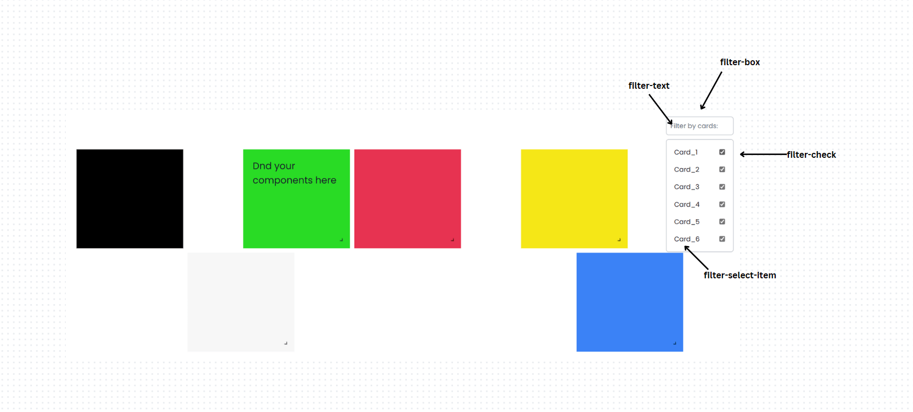

# Overview

Make your dashboard more powerfull with qodly-grid-layout build by the react-grid-layout library. This component will allow users to create draggable, resizable, and responsive grid layouts for their web applications. The library is particularly useful for creating dashboards, grid-based UIs, or any application where users need to arrange components dynamically.

## Qodly-grid-layout

## Warning

The build is not fully responsive but the render is responsive.

## Properties

| Name                | Attribute          | Type    | Required | Default                               | Description                                                                                                                                                                     |
| ------------------- | ------------------ | ------- | -------- | ------------------------------------- | ------------------------------------------------------------------------------------------------------------------------------------------------------------------------------- |
| `Filter Mode`       | `filterMode`       | Boolean | No       | true                                  | If set to true, you'll have the ability to filter and display the cards you mode.                                                                                               |
| `Save In Storage`   | `saveInStorage`    | Boolean | No       | false                                 | Saves the state in local storage if the data source is missing.                                                                                                                 |
| `Prevent Collision` | `preventCollision` | Boolean | No       | false                                 | Prevents collision between components.                                                                                                                                          |
| `Row Height`        | `rowHeight`        | Number  | Yes      | 30                                    | Static height for rows.                                                                                                                                                         |
| `Margin X`          | `marginX`          | Number  | Yes      | 10                                    | Horizontal margin between items [x, y] in pixels.                                                                                                                               |
| `Margin Y`          | `marginY`          | Number  | Yes      | 10                                    | Vertical margin between items [x, y] in pixels.                                                                                                                                 |
| `Cards`             | `cards`            | ICard[] | Yes      | One card by default with title Card_1 | This is the area where you will define how many cards will be displayed within the grid. You will have to give a unique name to each card's title in order for it to be visible |

## ICard

| Name        | Attribute     | Type    | Required | Default | Description                                           |
| ----------- | ------------- | ------- | -------- | ------- | ----------------------------------------------------- |
| `Title`     | `title`       | string  | Yes      | -       | Title of the card.                                    |
| `X`         | `x`           | number  | Yes      | 0       | X-coordinate to prevent collision between components. |
| `Y`         | `y`           | Number  | Yes      | 0       | Y-coordinate to determine the row height.             |
| `Height`    | `h`           | Number  | Yes      | 1       | Height of the card.                                   |
| `Width`     | `w`           | Number  | Yes      | 1       | Width of the card.                                    |
| `Static`    | `static`      | Boolean | No       | false   | If true, card cannot be dragged or resized.           |
| `Resizable` | `isResizable` | Boolean | No       | true    | If true, card cannot be resized.                      |
| `Draggable` | `isDraggable` | Boolean | No       | true    | If true, card cannot be dragged.                      |

## Datasource

| Name       | Type  | Required | Description                                                                                                                                                                                                                  |
| ---------- | ----- | -------- | ---------------------------------------------------------------------------------------------------------------------------------------------------------------------------------------------------------------------------- |
| datasource | Array | Depends  | Will contain the layout's array. If you use set the "save in local storage" property to true, you do not have to bind the layout with any datasource, else if set to false, you must bind it with a datasource of type array |

### Custom css

When it comes to customization, you can customize each card directly from the canva, and re-style the filter selectbox using css

These are the proposed classes within the component:

